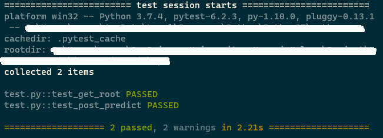

# Clickbait Detection


This app can classify a news headlines into clickbait and not clickbait label, the app use FastAPI for the API framework and using Logistic Regression and TFIDF to classify the label

Step to install

- clone the repo and navigate to inside the repo
- and run via command prompt or terminal
```python
pip install -r requirements.txt
python start.py
```

Step for testing
- navigate to the repo root directory and rund via command or terminal
```python
python -m pytest test.py -sv --disable-pytest-warnings
```

Example from testing


Original dataset [Kaggle](https://www.kaggle.com/bantalmetal/judul-artikel-online-dengan-label-clickbait)